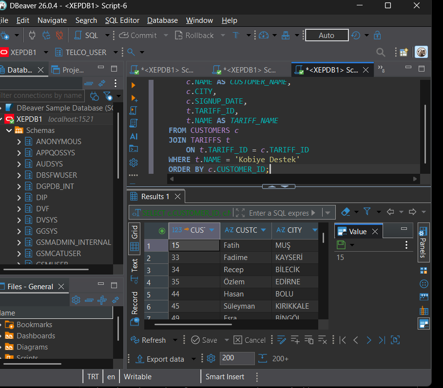
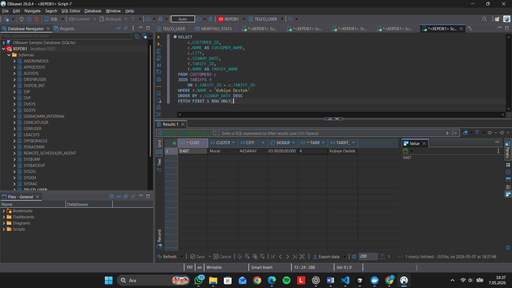
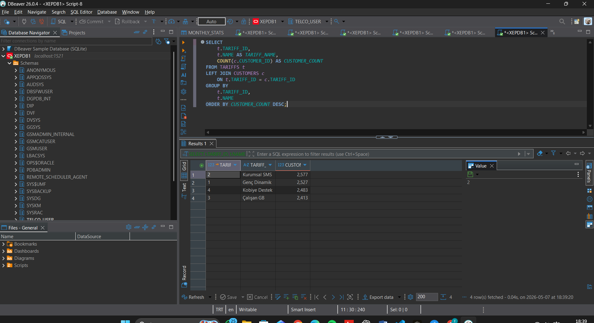
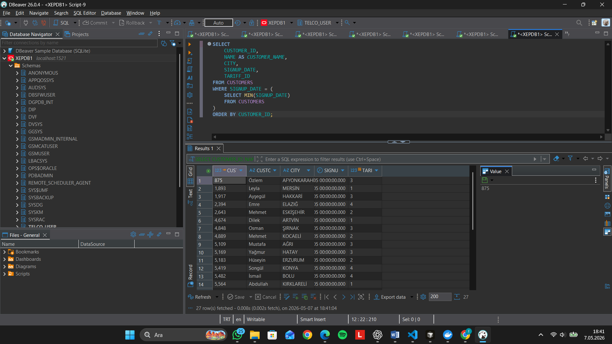
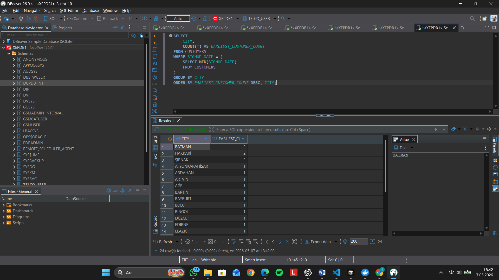
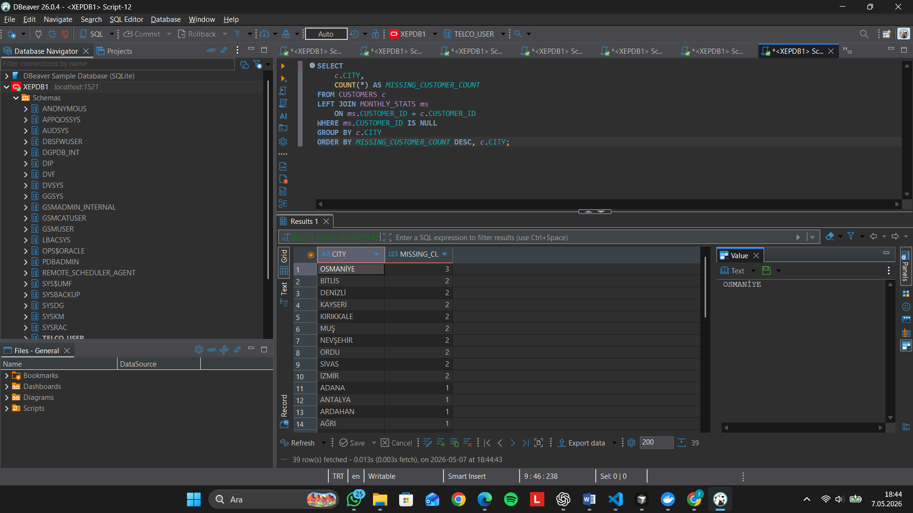
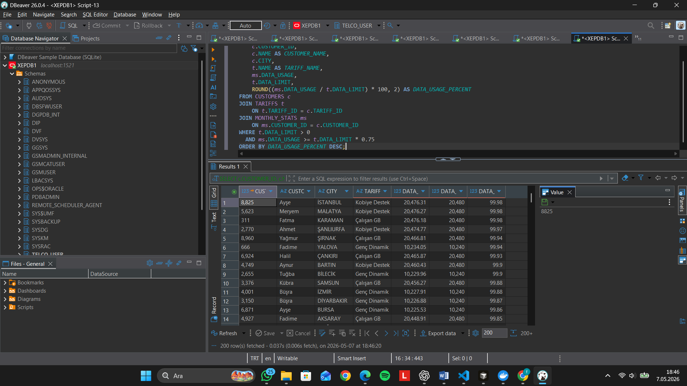
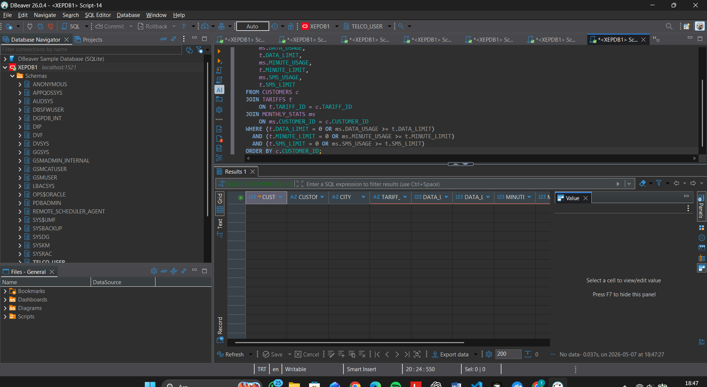
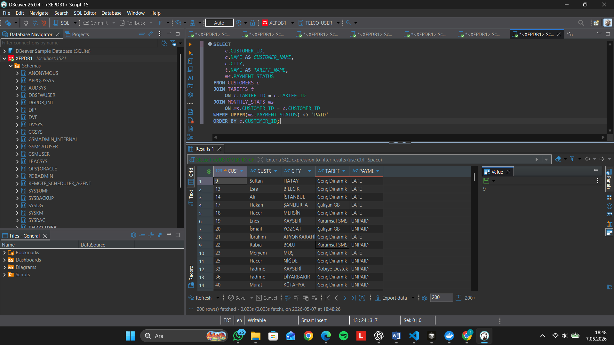
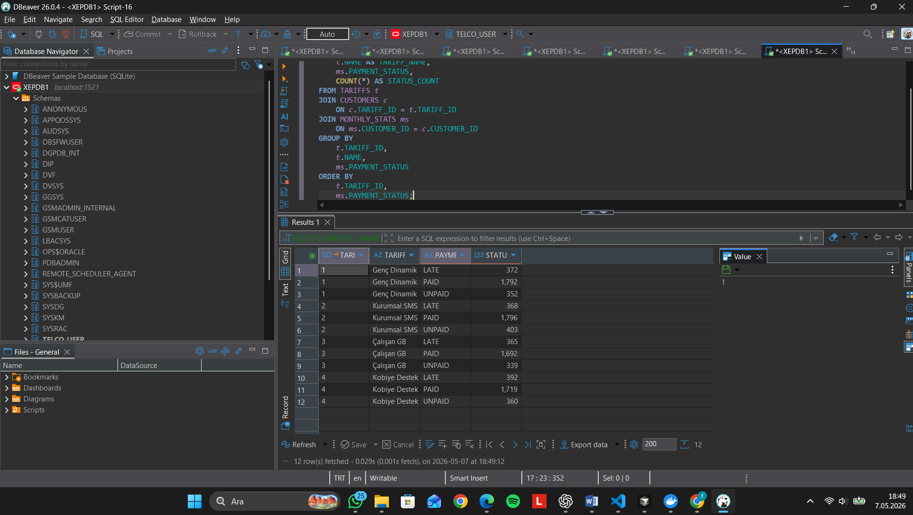

# Telco SQL Query Outputs

This file documents the output results for each SQL query in `SOLUTIONS.sql`.

Do not add sample or invented data. After running each query in Oracle XE through DBeaver, paste the real result rows or add a DBeaver output screenshot under the relevant section.

## 1.1 Customers Subscribed To The 'Kobiye Destek' Tariff

**Executed SQL query:**

```sql
SELECT
    c.CUSTOMER_ID,
    c.NAME AS CUSTOMER_NAME,
    c.CITY,
    c.SIGNUP_DATE,
    t.TARIFF_ID,
    t.NAME AS TARIFF_NAME
FROM CUSTOMERS c
JOIN TARIFFS t
    ON t.TARIFF_ID = c.TARIFF_ID
WHERE t.NAME = 'Kobiye Destek'
ORDER BY c.CUSTOMER_ID;
```

## 1.1 Customers Subscribed to the 'Kobiye Destek' Tariff

**Executed SQL query:**

```sql
SELECT
    c.CUSTOMER_ID,
    c.NAME AS CUSTOMER_NAME,
    c.CITY,
    c.SIGNUP_DATE,
    t.TARIFF_ID,
    t.NAME AS TARIFF_NAME
FROM CUSTOMERS c
JOIN TARIFFS t
    ON t.TARIFF_ID = c.TARIFF_ID
WHERE t.NAME = 'Kobiye Destek'
ORDER BY c.CUSTOMER_ID;
```

**Query output preview:**

| CUSTOMER_ID | CUSTOMER_NAME | CITY |
|---:|---|---|
| 15 | Fatih | MUŞ |
| 33 | Fadime | KAYSERİ |
| 34 | Recep | BİLECİK |
| 35 | Özlem | EDİRNE |
| 44 | Hasan | BOLU |
| 45 | Süleyman | KIRIKKALE |



**Test note:** This query was tested in Oracle XE using DBeaver. The result contains more than 200 rows, so only a preview of the output is documented here.

**Test note:** This query was tested in Oracle XE using DBeaver.

## 1.2 Newest Customer Subscribed To This Tariff

**Executed SQL query:**

```sql
SELECT
    c.CUSTOMER_ID,
    c.NAME AS CUSTOMER_NAME,
    c.CITY,
    c.SIGNUP_DATE,
    t.TARIFF_ID,
    t.NAME AS TARIFF_NAME
FROM CUSTOMERS c
JOIN TARIFFS t
    ON t.TARIFF_ID = c.TARIFF_ID
WHERE t.NAME = 'Kobiye Destek'
ORDER BY c.SIGNUP_DATE DESC
FETCH FIRST 1 ROW ONLY;
```

## 1.2 Newest Customer Subscribed To This Tariff

**Executed SQL query:**

```sql
SELECT
    c.CUSTOMER_ID,
    c.NAME AS CUSTOMER_NAME,
    c.CITY,
    c.SIGNUP_DATE,
    t.TARIFF_ID,
    t.NAME AS TARIFF_NAME
FROM CUSTOMERS c
JOIN TARIFFS t
    ON t.TARIFF_ID = c.TARIFF_ID
WHERE t.NAME = 'Kobiye Destek'
ORDER BY c.SIGNUP_DATE DESC
FETCH FIRST 1 ROW ONLY;
```

**Query output:**

| CUSTOMER_ID | CUSTOMER_NAME | CITY | SIGNUP_DATE | TARIFF_ID | TARIFF_NAME |
|---:|---|---|---|---:|---|
| 9487 | Murat | AKSARAY | 03/03/2026 00:00:00 | 4 | Kobiye Destek |



**Test note:** This query was tested in Oracle XE using DBeaver. The query returns only the most recent customer subscribed to the selected tariff.

**Test note:** This query was tested in Oracle XE using DBeaver.

## 2.1 Tariff Distribution Among Customers

**Executed SQL query:**

```sql
SELECT
    t.TARIFF_ID,
    t.NAME AS TARIFF_NAME,
    COUNT(c.CUSTOMER_ID) AS CUSTOMER_COUNT,
    ROUND(
        COUNT(c.CUSTOMER_ID) * 100 / NULLIF(SUM(COUNT(c.CUSTOMER_ID)) OVER (), 0),
        2
    ) AS CUSTOMER_PERCENTAGE
FROM TARIFFS t
LEFT JOIN CUSTOMERS c
    ON c.TARIFF_ID = t.TARIFF_ID
GROUP BY
    t.TARIFF_ID,
    t.NAME
ORDER BY CUSTOMER_COUNT DESC, TARIFF_NAME;
```

## 2.1 Tariff Distribution Among Customers

**Executed SQL query:**

```sql
SELECT
    t.TARIFF_ID,
    t.NAME AS TARIFF_NAME,
    COUNT(c.CUSTOMER_ID) AS CUSTOMER_COUNT
FROM TARIFFS t
LEFT JOIN CUSTOMERS c
    ON t.TARIFF_ID = c.TARIFF_ID
GROUP BY
    t.TARIFF_ID,
    t.NAME
ORDER BY CUSTOMER_COUNT DESC;
```

**Query output:**

| TARIFF_ID | TARIFF_NAME | CUSTOMER_COUNT |
|---:|---|---:|
| 2 | Kurumsal SMS | 2577 |
| 1 | Genç Dinamik | 2527 |
| 4 | Kobiye Destek | 2483 |
| 3 | Çalışan GB | 2413 |



**Test note:** This query was tested in Oracle XE using DBeaver. The output shows the customer distribution for each tariff.

**Test note:** This query was tested in Oracle XE using DBeaver.

## 3.1 Earliest Registered Customers

**Executed SQL query:**

```sql
SELECT
    c.CUSTOMER_ID,
    c.NAME AS CUSTOMER_NAME,
    c.CITY,
    c.SIGNUP_DATE,
    c.TARIFF_ID
FROM CUSTOMERS c
WHERE c.SIGNUP_DATE = (
    SELECT MIN(SIGNUP_DATE)
    FROM CUSTOMERS
)
ORDER BY c.CUSTOMER_ID;
```

## 3.1 Earliest Registered Customers

**Executed SQL query:**

```sql
SELECT
    CUSTOMER_ID,
    NAME AS CUSTOMER_NAME,
    CITY,
    SIGNUP_DATE,
    TARIFF_ID
FROM CUSTOMERS
WHERE SIGNUP_DATE = (
    SELECT MIN(SIGNUP_DATE)
    FROM CUSTOMERS
)
ORDER BY CUSTOMER_ID;
```

**Query output preview:**

| CUSTOMER_ID | CUSTOMER_NAME | CITY | TARIFF_ID |
|---:|---|---|---:|
| 875 | Özlem | AFYONKARAHİSAR | 3 |
| 1893 | Leyla | MERSİN | 1 |
| 1917 | Ayşegül | HAKKARİ | 3 |
| 2394 | Emre | ELAZIĞ | 4 |
| 2643 | Mehmet | ESKİŞEHİR | 2 |
| 4674 | Dilek | ARTVİN | 1 |
| 4848 | Osman | ŞIRNAK | 3 |
| 4889 | Mehmet | KOCAELİ | 2 |
| 5109 | Mustafa | AĞRI | 3 |
| 5169 | Yağmur | HATAY | 3 |



**Test note:** This query was tested in Oracle XE using DBeaver. The result contains 27 customers with the earliest registration date, so only a preview of the output is documented here.

**Test note:** This query was tested in Oracle XE using DBeaver.

## 3.2 City Distribution Of Earliest Customers

**Executed SQL query:**

```sql
SELECT
    c.CITY,
    COUNT(*) AS CUSTOMER_COUNT
FROM CUSTOMERS c
WHERE c.SIGNUP_DATE = (
    SELECT MIN(SIGNUP_DATE)
    FROM CUSTOMERS
)
GROUP BY c.CITY
ORDER BY CUSTOMER_COUNT DESC, c.CITY;
```

**Query output:**

| CITY | EARLIEST_CUSTOMER_COUNT |
|---|---:|
| BATMAN | 2 |
| HAKKARİ | 2 |
| ŞIRNAK | 2 |
| AFYONKARAHİSAR | 1 |
| ARDAHAN | 1 |
| ARTVİN | 1 |
| AĞRI | 1 |
| BARTIN | 1 |
| BAYBURT | 1 |
| BOLU | 1 |
| BİNGÖL | 1 |
| DÜZCE | 1 |
| EDİRNE | 1 |
| ELAZIĞ | 1 |



**Test note:** This query was tested in Oracle XE using DBeaver. The result contains 24 city rows, so only a preview of the output is documented here.


## 4.1 Missing Monthly Usage Records

**Executed SQL query:**

```sql
SELECT
    c.CUSTOMER_ID,
    c.NAME AS CUSTOMER_NAME,
    c.CITY,
    c.SIGNUP_DATE
FROM CUSTOMERS c
LEFT JOIN MONTHLY_STATS ms
    ON ms.CUSTOMER_ID = c.CUSTOMER_ID
WHERE ms.CUSTOMER_ID IS NULL
ORDER BY c.CUSTOMER_ID;
```

**Query output:**
| CUSTOMER_ID | CUSTOMER_NAME | CITY | TARIFF_ID |
|---:|---|---|---:|
| 6 | Fadime | KIRŞEHİR | 2 |
| 10 | Hakan | GAZİANTEP | 1 |
| 31 | Serkan | SİİRT | 3 |
| 39 | Yasemin | MUŞ | 1 |
| 45 | Süleyman | KIRIKKALE | 4 |
| 81 | Zehra | GİRESUN | 4 |
| 116 | Emre | ADANA | 1 |
| 136 | Zeynep | AĞRI | 2 |
| 140 | Abdullah | İZMİR | 4 |
| 156 | Mahmut | NEVŞEHİR | 2 |


**Test note:** This query was tested in Oracle XE using DBeaver. The result contains 50 customers whose monthly usage records are missing, so only a preview of the output is documented here.


## 4.2 City Distribution Of Missing Customers

**Executed SQL query:**

```sql
SELECT
    c.CITY,
    COUNT(*) AS MISSING_CUSTOMER_COUNT
FROM CUSTOMERS c
LEFT JOIN MONTHLY_STATS ms
    ON ms.CUSTOMER_ID = c.CUSTOMER_ID
WHERE ms.CUSTOMER_ID IS NULL
GROUP BY c.CITY
ORDER BY MISSING_CUSTOMER_COUNT DESC, c.CITY;
```

**Query output:**

| CITY | MISSING_CUSTOMER_COUNT |
|---|---:|
| OSMANİYE | 3 |
| BİTLİS | 2 |
| DENİZLİ | 2 |
| KAYSERİ | 2 |
| KIRIKKALE | 2 |
| MUŞ | 2 |
| NEVŞEHİR | 2 |
| ORDU | 2 |
| SİVAS | 2 |
| İZMİR | 2 |
| ADANA | 1 |
| ANTALYA | 1 |
| ARDAHAN | 1 |
| AĞRI | 1 |



**Test note:** This query was tested in Oracle XE using DBeaver. The result contains 39 city rows, so only a preview of the output is documented here.


## 5.1 Customers Who Used At Least 75% Of Their Data Limit

**Executed SQL query:**

```sql
SELECT
    c.CUSTOMER_ID,
    c.NAME AS CUSTOMER_NAME,
    t.NAME AS TARIFF_NAME,
    ms.DATA_USAGE,
    t.DATA_LIMIT,
    ROUND(ms.DATA_USAGE * 100 / t.DATA_LIMIT, 2) AS DATA_USAGE_PERCENTAGE
FROM CUSTOMERS c
JOIN TARIFFS t
    ON t.TARIFF_ID = c.TARIFF_ID
JOIN MONTHLY_STATS ms
    ON ms.CUSTOMER_ID = c.CUSTOMER_ID
WHERE t.DATA_LIMIT > 0
  AND ms.DATA_USAGE >= t.DATA_LIMIT * 0.75
ORDER BY DATA_USAGE_PERCENTAGE DESC, c.CUSTOMER_ID;
```

**Query output:**

| CUSTOMER_ID | CUSTOMER_NAME | CITY | TARIFF_NAME | DATA_USAGE | DATA_LIMIT | DATA_USAGE_PERCENT |
|---:|---|---|---|---:|---:|---:|
| 8825 | Ayşe | İSTANBUL | Kobiye Destek | 20476.31 | 20480 | 99.98 |
| 5623 | Meryem | MALATYA | Kobiye Destek | 20476.27 | 20480 | 99.98 |
| 311 | Fatma | KARAMAN | Çalışan GB | 20476.18 | 20480 | 99.98 |
| 2770 | Ahmet | ŞANLIURFA | Kobiye Destek | 20474.77 | 20480 | 99.97 |
| 8960 | Yağmur | ŞIRNAK | Çalışan GB | 20466.81 | 20480 | 99.94 |
| 666 | Fadime | YALOVA | Genç Dinamik | 10234.05 | 10240 | 99.94 |
| 6924 | Halil | ÇANKIRI | Çalışan GB | 20465.87 | 20480 | 99.93 |
| 4749 | Aynur | BARTIN | Kobiye Destek | 20460.43 | 20480 | 99.90 |
| 2655 | Tuğba | BİLECİK | Genç Dinamik | 10229.96 | 10240 | 99.90 |
| 3376 | Kübra | SAMSUN | Çalışan GB | 20456.27 | 20480 | 99.88 |



**Test note:** This query was tested in Oracle XE using DBeaver. The result contains more than 200 rows, so only a preview of the output is documented here.


## 5.2 Customers Who Fully Consumed All Package Limits

**Executed SQL query:**

```sql
SELECT
    c.CUSTOMER_ID,
    c.NAME AS CUSTOMER_NAME,
    t.NAME AS TARIFF_NAME,
    ms.DATA_USAGE,
    t.DATA_LIMIT,
    ms.MINUTE_USAGE,
    t.MINUTE_LIMIT,
    ms.SMS_USAGE,
    t.SMS_LIMIT
FROM CUSTOMERS c
JOIN TARIFFS t
    ON t.TARIFF_ID = c.TARIFF_ID
JOIN MONTHLY_STATS ms
    ON ms.CUSTOMER_ID = c.CUSTOMER_ID
WHERE (t.DATA_LIMIT = 0 OR ms.DATA_USAGE >= t.DATA_LIMIT)
  AND (t.MINUTE_LIMIT = 0 OR ms.MINUTE_USAGE >= t.MINUTE_LIMIT)
  AND (t.SMS_LIMIT = 0 OR ms.SMS_USAGE >= t.SMS_LIMIT)
ORDER BY c.CUSTOMER_ID;
```

**Query output:**

| Result |
|---|
| No data returned |



**Test note:** This query was tested in Oracle XE using DBeaver. No customers fully consumed all package limits for data, minutes, and SMS at the same time.


## 6.1 Customers With Unpaid Charges

**Executed SQL query:**

```sql
SELECT
    c.CUSTOMER_ID,
    c.NAME AS CUSTOMER_NAME,
    c.CITY,
    t.NAME AS TARIFF_NAME,
    ms.PAYMENT_STATUS
FROM CUSTOMERS c
JOIN TARIFFS t
    ON t.TARIFF_ID = c.TARIFF_ID
JOIN MONTHLY_STATS ms
    ON ms.CUSTOMER_ID = c.CUSTOMER_ID
WHERE TRIM(UPPER(ms.PAYMENT_STATUS)) <> 'PAID'
ORDER BY ms.PAYMENT_STATUS, c.CUSTOMER_ID;
```

**Query output:**

| CUSTOMER_ID | CUSTOMER_NAME | CITY | TARIFF_NAME | PAYMENT_STATUS |
|---:|---|---|---|---|
| 9 | Sultan | HATAY | Genç Dinamik | LATE |
| 13 | Esra | BİLECİK | Genç Dinamik | LATE |
| 14 | Ali | İSTANBUL | Genç Dinamik | LATE |
| 17 | Hakan | ŞANLIURFA | Çalışan GB | LATE |
| 18 | Hacer | MERSİN | Genç Dinamik | LATE |
| 19 | Enes | KAYSERİ | Kurumsal SMS | UNPAID |
| 20 | İsmail | YOZGAT | Çalışan GB | UNPAID |
| 21 | İbrahim | AFYONKARAHİSAR | Genç Dinamik | LATE |
| 22 | Rabia | BOLU | Kurumsal SMS | UNPAID |
| 23 | Meryem | MUŞ | Genç Dinamik | LATE |



**Test note:** This query was tested in Oracle XE using DBeaver. The result contains more than 200 rows, so only a preview of the output is documented here.


## 6.2 Payment Status Distribution Across Tariffs

**Executed SQL query:**

```sql
SELECT
    t.TARIFF_ID,
    t.NAME AS TARIFF_NAME,
    TRIM(UPPER(ms.PAYMENT_STATUS)) AS PAYMENT_STATUS,
    COUNT(*) AS PAYMENT_STATUS_COUNT,
    ROUND(
        COUNT(*) * 100 / NULLIF(SUM(COUNT(*)) OVER (PARTITION BY t.TARIFF_ID), 0),
        2
    ) AS STATUS_PERCENTAGE_WITHIN_TARIFF
FROM MONTHLY_STATS ms
JOIN CUSTOMERS c
    ON c.CUSTOMER_ID = ms.CUSTOMER_ID
JOIN TARIFFS t
    ON t.TARIFF_ID = c.TARIFF_ID
GROUP BY
    t.TARIFF_ID,
    t.NAME,
    TRIM(UPPER(ms.PAYMENT_STATUS))
ORDER BY t.NAME, PAYMENT_STATUS_COUNT DESC, PAYMENT_STATUS;
```

**Query output:**

Feyza_Sağman.pdf
PDF
Bir başvuru içim bunları yapmam laızm sana cv mi dr atpypurom iyice anla 
FEYZA_TÜBİTAK.pdf
PDF
BU SORULARI CEVAPLAYALIM AMA BENCE TÜBİTAKTA Kİ PROJEYİ DETAYLANDIRALIM BEN SANA ONUN BELGESİNİ ATTIM BENCE BU PROJE DAHA DİKKAT ÇEKİCİ İLK ÖNCE STAJLARIM SORUSUNU YAPALIM ONUN İÇİNDE CV Mİ OKU VE ŞUAN GOOGLE YAPAY ZEKA AKADEMİSİNDE VERİ BİLİMİ ALANINDA BURSİYER OLDUĞUMU UNUTMA
2247_c_sonuc_raporu_formu.pdf
PDF
TÜBİTAK 2209-A PROJESİ ŞUAN KABUL BEKLİYORUM VE TÜBİTAK 2247-C İÇİNDE SANA BELGE ATACAĞIM BEKLE

ŞİMDİ BÜTÜN YAZIYI GÜZEL FORMATTA VER
BU SORUYA CEVAP
BU SORU İÇİN DOĞRU CEVAP MI
VERİBİLİMİ EKLE R EKLE
DAHA GÜÇLÜ OLDUKALRIMI YAZALIM
Python, R, JavaScript, SQL, Firebase, Git, Figma, React Native, Android development, Data Science, data analysis, machine learning fundamentals, text processing, data extraction, automation, LLM-supported chatbot development, web/mobile application development, UI/UX design, technical documentation, teamwork, problem solving, and project management.
My strongest skills are Python, R, SQL, Data Science, data analysis, machine learning fundamentals, text processing, data extraction, automation, LLM-supported chatbot development, analytical thinking, research-based problem solving, technical documentation, teamwork, communication, project planning, and fast learning.

BUNLARIN HEPSİNDEN EN GÜÇLÜ VE DEĞERLİ OLANALRI VE KEİSNLİKLE VERİ VE YAPAY ZEKAYI ÖNE ÇIAKR AMA HEPSİNİNDE UNUTMA
PYTHON SQL FALANALRI NEDEN EKLEMEDİN
Python, SQL, R, Data Science, artificial intelligence fundamentals, machine learning fundamentals, data analysis, text processing, data extraction, automation, LLM-supported chatbot development, JavaScript, Firebase, Git, Figma, React Native, Android development, web/mobile application development, UI/UX design, analytical thinking, research-based problem solving, technical documentation, teamwork, communication, project planning, and fast learning.

BİRAZ KISALT
JAVA FALANFDA EKLE C# DE
BAŞVURUM İÇİN EN İYİ FORMATI VER ÖNE ÇIKARACAK ŞEYLERİ VE PROJELERİMİ ÖNE ÇIKAR
CV_FEYZA_son_bos_sayfa_silindi.docx
Belge
BUNU İNGİLİZCE YAPALIM
CV_FEYZA_son_bos_sayfa_silindi.docx
Belge
CV BELGEMİ İNGİZLİZCEYE ÇEVİR  VE YETENEK KSIMINA YAPAY ZEKA VE VERİ BİLİMİ DE EKLE .DOC OALRAK VER
FORMATI BOZDUN 
Genel Bakış
Bu proje, web geliştirme alanında kodlama becerilerinizi değerlendirmek için tasarlanmıştır. OMDB API'sini tüketen basit bir web uygulaması oluşturmanız gerekiyor.

Başvuru tamamen yanıt verebilir bir Tek Sayfa Uygulaması (SPA) olmalı ve başlık, yıl, tür, yönetmen ve poster gibi film detaylarını göstermelidir.
Uygulama HTML, CSS ve JavaScript kullanılarak yazılmalıdır.
Projeniz tüm gereksinimleri karşılıyorsa, ek işlevlerle genişletebilirsiniz.
Geliştirmeden sonra projeyi GitHub Pages kullanarak dağıtmalısınız. GitHub Sayfalarına dağıtılmayan projeler değerlendirilmez ve 0 puan alır.
Bu şablonu kullanarak kendi deposunu oluşturup çalışmalarınızı oraya yüklemelisiniz. Değişiklikleri doğrudan bu depoya veya orijinal dallarına göndermeye çalışmayın.

Fonksiyonel Gereksinimler
Film Arama Girişi

Kullanıcılar bir film adını girebilmeli ve arama başlatabilmelidir.
Bir arama kutusu ve buton yeterlidir, ancak iyi düzenlenmiş arayüz öğeleri (örneğin sahibinden.com'ye benzer filtreler) eklemek bonus puan kazandırır.
Film Detaylarını Göster

En azından gösteri: Başlık, Yıl, Tür, Yönetmen ve Poster görseli.
Tasarım size kalmış.
Hata Yönetimi

Film bulunmazsa veya API hata dönerse, kullanıcıya açık bir mesaj gösterin.
Çözülmeyen hatalar puan kesintilerine yol açar.
Çoklu Arama

Kullanıcılar sayfayı yenilemeden birden fazla arama yapabilmelidir.
Sayfa yenilenirse, son arama görünümü korunmalıdır (örneğin, LocalStorage veya URL parametreleri kullanılarak).
Backend Proxy (isteğe bağlı)

Bir backend uygularsanız, API isteklerini işlemeli ve temiz JSON'u ön yüze döndürmelidir.
Fonksiyonel Olmayan Gereksinimler
Performans

API çağrıları verimli olmalı. Gereksiz tekrar yapılan taleplerden kaçının.
Kullanılabilirlik

Arayüz basit, sezgisel ve kullanıcı dostu olmalıdır.
Tasarım size kalmış.
Taşınabilirlik

Uygulama modern tarayıcılarda çalışmalı ve farklı ekran boyutlarına duyarlı olmalıdır.
Bakım Edilebilirliği

Kod modüler, iyi belgelenmiş ve kolayca genişletilmesi gereken olmalıdır.
Teslimatlar ve Gönderim
Projeyi tamamladıktan sonra, aşağıdakileri hazır hale getirdiğinizden emin olun:

Proje kodunuzu içeren (şablon aracılığıyla oluşturulan) bir kamuya açık GitHub deposu.
GitHub Pages'te dağıtılan projenin barındırılan bir sürümü.

omdb projesi bu beraber yapalım

dosyayı cursorda açıp orda komutla yaptırsam olur mu
apı key nerden alacağım
http://www.omdbapi.com/apikey.aspx?VERIFYKEY=db1fdba2-0f31-4e83-8f5a-944fb521602c
db1fdba2-0f31-4e83-8f5a-944fb521602c
bu attığım apı değil mi
koydum apı keyi de şimdi ne yapalım
https://github.com/feyzasagman/omdb-project

repo bu
C:\Users\feyza\OneDrive\Music\Desktop\omdb-movie-search>git push -u origin main
To https://github.com/feyzasagman/omdb-project.git
 ! [rejected]        main -> main (fetch first)
error: failed to push some refs to 'https://github.com/feyzasagman/omdb-project.git'
hint: Updates were rejected because the remote contains work that you do not
hint: have locally. This is usually caused by another repository pushing to
hint: the same ref. If you want to integrate the remote changes, use
hint: 'git pull' before pushing again.
hint: See the 'Note about fast-forwards' in 'git push --help' for details.
yükledim githubda neyi değşitireceğiz
naısl yapacağım
Genel Bakış
Bu projede, i2i Systems'te geliştirici rolünü üstleneceksiniz; burada veritabanı işlemleriyle çeşitli ekip taleplerini yerine getirmekten sorumlu olacaksınız.

Sunulan soruları yanıtlamak için telekomünikasyonla ilgili veri içeren dosyalar alacaksınız. Lütfen çalışmalarınızı aşağıdaki şekilde düzenlediniz:.csv

SQL sorgu çözümlerinizi ayrı bir dosyada kaydedin (örneğin, ).SOLUTIONS.sql
Veritabanı tablosu oluşturma betiklerinizi, ilgili indeksleri ve kısıtlamalarıyla birlikte başka ayrı bir dosyaya ekleyin (örneğin, ).TABLE_CREATION_SCRIPTS.sql
Bu şablonu kullanarak kendi deposunu oluşturup çalışmalarınızı oraya yüklemelisiniz. Değişiklikleri doğrudan bu depoya veya orijinal dallarına göndermeye çalışmayın.

Operasyonel Gereksinimler
Oracle XE Kurulumu
Oracle XE çalıştıran bir Docker konteyneri oluşturun.
Veritabanının doğru şekilde yapılandırıldığından ve yerel makinenizden erişilebilir olduğundan emin olun.
DBeaver Kurulumu
DBeaver'ı indirip kurun.
DBeaver istemcisini kullanarak yerel Oracle XE örneğinize bağlantı kurun.
Veri İç Aktarma
Telekom verilerini içeren dosyaları kullanarak Oracle XE'de gerekli tabloları tasarlayıp oluşturabilirsiniz..csv
Dosyalardan verileri yeni oluşturduğunuz tablolara aktarın, böylece şemanın sağlanan veri setini doğru şekilde yansıtmasını sağlarsınız..csv
Bonus Görevler (Ekstra puan için isteğe bağlı)
Docker Yazı ve Tekrarlanabilirlik: Oracle XE veritabanı ortamını kolayca başlatmak için bir dosya sağlayın. Deponuza kurulumunuzu yeniden üretme sürecini adım adım açıklayan net bir dokümantasyon ekleyin (ekran görüntüleri ile).docker-compose.yml
Otomatik Veritabanı Tohumlama: Docker Compose kurulumunuzu konteyner başlatıldığında veritabanı betiklerinizi (tablo oluşturma) otomatik olarak çalıştıracak şekilde ayarlayın.
Fonksiyonel Gereksinimler
Aşağıda listelenen senaryoları ele almak için SQL sorguları yazmalısınız. Her sorgu için, yaklaşımınızı en az üç cümleyle açıklayan yorumlar ekleyin. Eksik cevaplar veya gerekli süreden kısa açıklamalar değerlendirilmez ve 0 puan alırlar.

1. Tarife Tabanlı Müşteri Soruları
1.1 'Kobiye Destek' tarifesine abone olan müşterileri listeleyin.
1.2 Bu tarifeye abone olan en yeni müşteriyi bulun.

2. Tarife Dağıtımı
2.1 Tarifelerin müşteriler arasında dağılımını bulmak.

3. Müşteri Kayıt Analizi
3.1 En erken kayıt olan müşterileri belirleyin.
(İpucu: En erken müşterilerin en düşük kimlikleri olması mutlaka mümkün olmayabilir.)

3.2 Bu en erken müşterilerin farklı şehirler arasındaki dağılımını, her şehrin toplam sayısını da dahil olmak üzere bulun.

4. Kayıp Aylık Kayıtlar
4.1 Her müşterinin aylık bir ücreti vardır ve veri seti bu ayın kullanım değerlerini içerir. Ancak, bir ekleme hatası meydana geldi ve bazı müşterilerin aylık kayıtları eksik. Bu kayıp müşterilerin kimliklerini belirleyin.

4.2 Bu kayıp müşterilerin farklı şehirler arasında dağılımını bul.

5. Kullanım Analizi
5.1 Veri limitinin en az %75'ini kullanmış müşterileri bulun.
5.2 Tüm paket limitlerini (veri, dakikalar ve SMS) tamamen tüketen müşterileri belirleyin.

6. Ödeme Analizi
6.1 Ödenmemiş ücretleri olan müşterileri bulun.
6.2 Tüm ödeme durumlarının farklı tarifeler arasında dağılımını bul.

Notlar
Veritabanı şemasını istediğiniz gibi, sağlanan veri setine göre tasarlama özgürlüğüne sahipsiniz.
Tablolarınızı oluştururken uygun veri türlerini ve kısıtlamaları uygulamaya dikkat edin.
Oracle XE'ye veri aktarmalarını yönetmek için DBeaver veya SQL*Plus kullanabilirsiniz..csv
Her sorguyu iyice test edin ve hem SQL ifadesini hem de çıkan çıktısını gönderinizde belgeleyin.


şimdi diğer projeye geçelim,
cursora promt verelim 
 hangisini atmalıyım sana
TARIFFS
MONTHLY STATS
CUSTOMERS
https://github.com/feyzasagman/telco-project
dosya yapsııs doğru mu
Veritabanı şemasını istediğiniz gibi, sağlanan veri setine göre tasarlama özgürlüğüne sahipsiniz.
Tablolarınızı oluştururken uygun veri türlerini ve kısıtlamaları uygulamaya dikkat edin.
Oracle XE'ye veri aktarmalarını yönetmek için DBeaver veya SQL*Plus kullanabilirsiniz..csv
Her sorguyu iyice test edin ve hem SQL ifadesini hem de çıkan çıktısını gönderinizde belgeleyin.
doğru mu
TABLE_CREATION_SCRIPTS.sql ile tabloları oluştur.
CSV dosyalarını DBeaver’dan import et.
SOLUTIONS.sql içindeki sorguları tek tek çalıştır.
Çıkan sonuçları QUERY_OUTPUTS.md içine yapıştır.
adım adım yapalım
C:\Users\feyza\OneDrive\Music\Desktop\telco-project>docker compose up -d
unable to get image 'gvenzl/oracle-xe:21-slim': error during connect: Get "http://%2F%2F.%2Fpipe%2FdockerDesktopLinuxEngine/v1.51/images/gvenzl/oracle-xe:21-slim/json": open //./pipe/dockerDesktopLinuxEngine: The system cannot find the file specified.

C:\Users\feyza\OneDrive\Music\Desktop\telco-project>docker ps
failed to connect to the docker API at npipe:////./pipe/dockerDesktopLinuxEngine; check if the path is correct and if the daemon is running: open //./pipe/dockerDesktopLinuxEngine: The system cannot find the file specified.

C:\Users\feyza\OneDrive\Music\Desktop\telco-project>
DEVAM
2. DBeaver’da Oracle bağlantısını aç NASIL AÇACAĞIM
DBEAVER YÜKLÜ DEĞİL BENDE
OLMADI
NASIL YAPACAĞIM
TAMAMDIR DEVAM
DEVAM
OLDU DEVAM
anlamadım
## 1.1 Customers Subscribed to the 'Kobiye Destek' Tariff

**Executed SQL query:**


sql
SELECT
    c.CUSTOMER_ID,
    c.NAME AS CUSTOMER_NAME,
    c.CITY,
    c.SIGNUP_DATE,
    t.TARIFF_ID,
    t.NAME AS TARIFF_NAME
FROM CUSTOMERS c
JOIN TARIFFS t
    ON t.TARIFF_ID = c.TARIFF_ID
WHERE t.NAME = 'Kobiye Destek'
ORDER BY c.CUSTOMER_ID;


**Query output preview:**

| TARIFF_ID | TARIFF_NAME | PAYMENT_STATUS | STATUS_COUNT |
|---:|---|---|---:|
| 1 | Genç Dinamik | LATE | 372 |
| 1 | Genç Dinamik | PAID | 1792 |
| 1 | Genç Dinamik | UNPAID | 352 |
| 2 | Kurumsal SMS | LATE | 368 |
| 2 | Kurumsal SMS | PAID | 1796 |
| 2 | Kurumsal SMS | UNPAID | 403 |
| 3 | Çalışan GB | LATE | 365 |
| 3 | Çalışan GB | PAID | 1692 |
| 3 | Çalışan GB | UNPAID | 339 |
| 4 | Kobiye Destek | LATE | 392 |
| 4 | Kobiye Destek | PAID | 1719 |
| 4 | Kobiye Destek | UNPAID | 360 |



**Test note:** This query was tested in Oracle XE using DBeaver. The output shows how payment statuses are distributed across each tariff.


